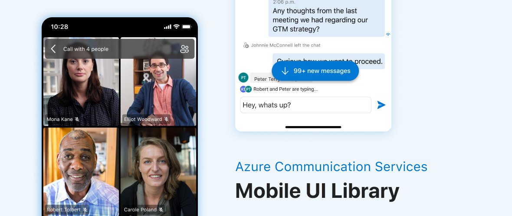

# Azure Communication UI Mobile Library for Android

Azure Communication [UI Mobile Library](https://docs.microsoft.com/en-us/azure/communication-services/concepts/ui-library/ui-library-overview) is an Azure Communication Services capability focused on providing UI components for common business-to-consumer and business-to-business calling interactions.

### Prerequisites

- An Azure account with an active subscription. [Create an account for free](https://azure.microsoft.com/free/?WT.mc_id=A261C142F).
- An OS running [Android Studio](https://developer.android.com/studio).
- A deployed Communication Services resource. [Create a Communication Services resource](https://docs.microsoft.com/azure/communication-services/quickstarts/create-communication-resource).
- Azure Communication Services Token. [See example](https://docs.microsoft.com/azure/communication-services/tutorials/trusted-service-tutorial)

## Libraries

Azure Communication Service Mobile UI currently offers the following libraries:

### [Calling](/azure-communication-ui/calling/)

Calling experience allows users to start or join a call. Inside the experience, users can configure their devices, participate in the call with video, and see other participants, including those ones with video turned on. For Teams interoperability, CallComposite includes lobby functionality so that users can wait to be admitted. For more information about calling composite and how you can integrate it into your application, click [here](/azure-communication-ui/calling/).

### [Chat](/azure-communication-ui/chat/)

Chat experience brings a real-time text communication to your applications. Similar to Calling, Chat also offers Teams interoperability where users can join Teams meetings and communicate with Teams chat messages.

Learn more about how to integrate Chat to your applications, click [here](/azure-communication-ui/chat/).

## Contributing to the Library

Before developing and contributing to Communication Mobile UI Library, check out our [making a contribution guide](docs/contributing-guide.md).  
Included in this repository is a demo of using Mobile UI Library to start or join a call and chat. You can find the detail of using and developing the UI Library in the [Demo Guide](azure-communication-ui/demo-app).

This project has adopted the [Microsoft Open Source Code of Conduct](https://opensource.microsoft.com/codeofconduct/). For more information see the [Code of Conduct FAQ](https://opensource.microsoft.com/codeofconduct/faq/) or contact [opencode@microsoft.com](mailto:opencode@microsoft.com) with any additional questions or comments. Also, please check our [Contribution Policy](docs/contributing-guide.md). 

## Data Collection

The software may collect information about you and your use of the software and send it to Microsoft. Microsoft may use this information to provide services and improve our products and services. The azure-communication-ui-calling and azure-communication-ui-chat library collects information about users and their use of the software that cannot be opted out of. Do not use these libraries if you wish to avoid telemetry. You can learn more about data collection and use in the help documentation and Microsoft’s [privacy statement](https://go.microsoft.com/fwlink/?LinkID=824704). For more information on the data collected by the Azure SDK, please visit the [Telemetry Policy](https://learn.microsoft.com/azure/communication-services/concepts/privacy) page.

## Community Help and Support

If you find a bug or have a feature request, please raise the issue on [GitHub Issues](https://github.com/Azure/communication-ui-library-android/issues).

## Known Issues

Please refer to the [wiki](https://github.com/Azure/communication-ui-library-android/wiki/Known-Issues) for known issues related to the library.

## Further Reading

* [Azure Communication UI Library Conceptual Documentation](https://docs.microsoft.com/azure/communication-services/concepts/ui-framework/ui-sdk-overview)
* [Azure Communication Service](https://docs.microsoft.com/en-us/azure/communication-services/overview)
* [Azure Communication Client and Server Architecture](https://docs.microsoft.com/en-us/azure/communication-services/concepts/client-and-server-architecture)
* [Azure Communication Authentication](https://docs.microsoft.com/en-us/azure/communication-services/concepts/authentication)
* [Azure Communication Service Troubleshooting](https://docs.microsoft.com/en-us/azure/communication-services/concepts/troubleshooting-info)
* [Azure Communication Service UI Calling Library Maven Releases](https://search.maven.org/artifact/com.azure.android/azure-communication-ui-calling)
* [Azure Communication Service UI Chat Library Maven Releases](https://search.maven.org/artifact/com.azure.android/azure-communication-ui-chat)
* [Azure Communication Service Android Calling Hero Sample](https://github.com/Azure-Samples/communication-services-android-calling-hero)
