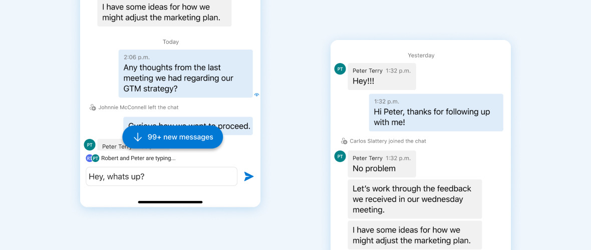

# Azure Communication UI Mobile Library for Android

Get started with Azure Communication Chat Services by using the UI Library to integrate communication experiences into your applications. For instructions to quickly integrate the UI Library functionalities, please follow our guide below.


### Install the packages

In your app level (**app folder**) `build.gradle`, add the following lines to the dependencies and android sections.

```groovy
android {
    ...
    packagingOptions {
        pickFirst  'META-INF/*'
    }
    ...
}
```

```groovy
dependencies {
    ...
    implementation 'com.azure.android:azure-communication-ui-chat:0.1.0'
    ...
}
```

In your project gradle scripts add following lines to `repositories`. For `Android Studio (2020.*)` the `repositories` are in `settings.gradle` `dependencyResolutionManagement(Gradle version 6.8 or greater)`. If you are using old versions of `Android Studio (4.*)` then the `repositories` will be in project level `build.gradle` `allprojects{}`.

```groovy
repositories {
    ...
    mavenCentral()
    maven {
        url "https://pkgs.dev.azure.com/MicrosoftDeviceSDK/DuoSDK-Public/_packaging/Duo-SDK-Feed/maven/v1"
    }
    ...
}
```
Sync project with gradle files. (Android Studio -> File -> Sync Project With Gradle Files)


### Quick Sample 

Create `ChatComposite` and launch it. Replace `<USER_ACCESS_TOKEN>` with your token and `<USER_ID>` with your identity string from your azure communication resource's Identity & User Access Tokens settings. Also replace `<DISPLAY_NAME>` with your name and `<THREAD_ID>` with your chat thread ID and `<ENDPOINT_URL>` with your endpoint from your communication resource.

#### [Kotlin](#tab/kotlin)

```kotlin
val communicationTokenRefreshOptions = CommunicationTokenRefreshOptions("<USER_ACCESS_TOKEN>", true)
val communicationTokenCredential = CommunicationTokenCredential(communicationTokenRefreshOptions)

val chatUIClient = ChatUIClientBuilder()
    .context(context)
    .endpoint("<ENDPOINT>")
    .credential(communicationTokenCredential)
    .identity(CommunicationUserIdentifier(acsIdentity))
    .displayName(userName)
    .build()

chatUIClient.addOnErrorEventHandler(errorHandler)
val chatThreadAdapter = ChatThreadAdapter(chatUIClient, threadId)
val chatThreadView = ChatThreadView(context, chatThreadAdapter)

```

#### [Java](#tab/java)

```java
CommunicationTokenRefreshOptions communicationTokenRefreshOptions = new CommunicationTokenRefreshOptions("<USER_ACCESS_TOKEN>", true);
        CommunicationTokenCredential communicationTokenCredential = new CommunicationTokenCredential(communicationTokenRefreshOptions);

        ChatUIClient chatUIClient = new ChatUIClientBuilder()
        .context(context)
        .endpoint("<ENDPOINT>")
        .credential(communicationTokenCredential)
        .identity(new CommunicationUserIdentifier(acsIdentity))
        .displayName(userName)
        .build();

        chatUIClient.addOnErrorEventHandler(errorHandler);
        ChatThreadAdapter chatThreadAdapter = new ChatThreadAdapter(chatUIClient, threadId);
        ChatThreadView chatThreadView = new ChatThreadView(context, chatThreadAdapter);
```

Chat screen is supported as both composite and an independent view which supports view binding and enables the application developers to integrate the chat capabilities in their application in either way. For example, one can launch ChatComposite in either the application activity or on any inflated view. You can find the detail of using the Chat UI Library in the [Demo Guide](../../azure-communication-ui/demo-app/).

For more details on Mobile UI Library functionalities visit the [API Reference Documentation](https://azure.github.io/azure-sdk-for-android/azure-communication-mobileui/index.html). 


## Known Issues

Please refer to the [wiki](https://github.com/Azure/communication-ui-library-android/wiki/Known-Issues) for known issues related to the library.

## Further Reading

* [Azure Communication UI Library Conceptual Documentation](https://docs.microsoft.com/azure/communication-services/concepts/ui-framework/ui-sdk-overview)
* [Azure Communication Service](https://docs.microsoft.com/en-us/azure/communication-services/overview)
* [Azure Communication Client and Server Architecture](https://docs.microsoft.com/en-us/azure/communication-services/concepts/client-and-server-architecture)
* [Azure Communication Authentication](https://docs.microsoft.com/en-us/azure/communication-services/concepts/authentication)
* [Azure Communication Service Troubleshooting](https://docs.microsoft.com/en-us/azure/communication-services/concepts/troubleshooting-info)
