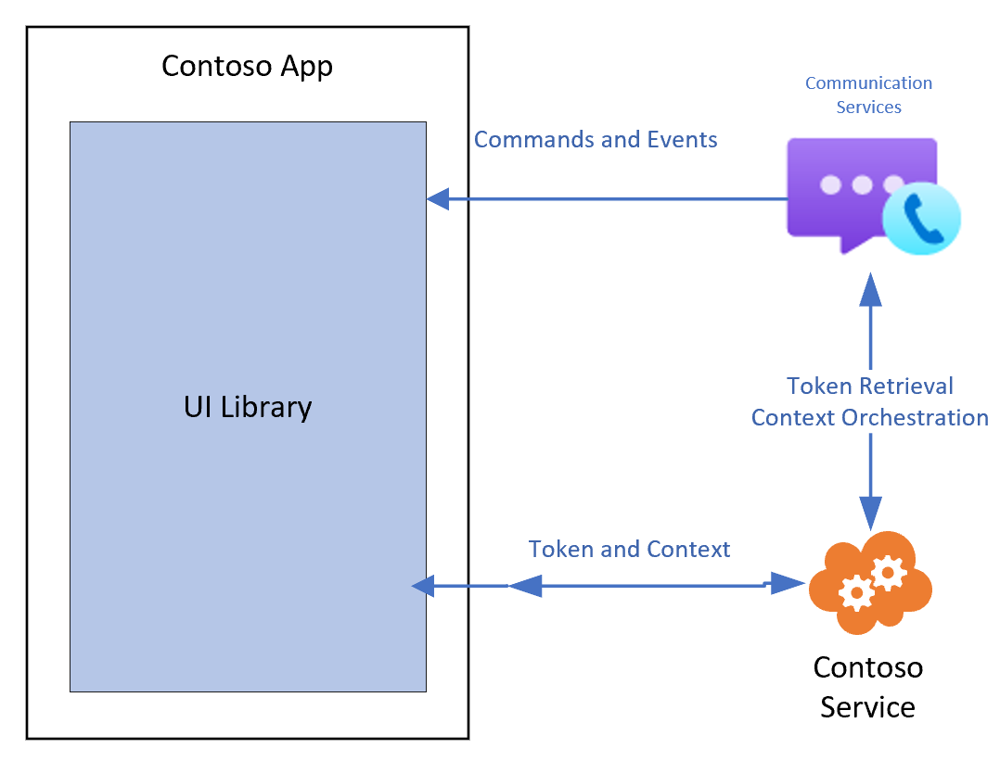

# UI Library (iOS and Android) Use Cases

UI Library for iOS and Android supports calling use cases through the use of the calling composite.
Composites enables developers to easily integrate a full calling experience into their application with only a couple lines of code.
Composites take care of the entire lifecycle of the call from setup to the call ending.

## Calling Use Cases

| Area                                                                                            | Use Cases                                              |
| ----------------------------------------------------------------------------------------------- | ------------------------------------------------------ |
| Call Types                                                                                      | Join Teams Meeting                                     |
|                                                                                                 | Join Azure Communication Services call with Group Id   |
| [Teams Interop](https://docs.microsoft.com/azure/communication-services/concepts/teams-interop) | Call Lobby                                             |
|                                                                                                 | Transcription and recording alert banner               |
| Call Controls                                                                                   | Mute/unmute call                                       |
|                                                                                                 | Video on/off on call                                   |
|                                                                                                 | End call                                               |
| Participant Gallery                                                                             | Remote participants are displayed on grid              |
|                                                                                                 | Video preview available throughout call for local user |
|                                                                                                 | Default avatars available when video is off            |
|                                                                                                 | Shared screen content displayed on participant gallery |
| Call configuration                                                                              | Microphone device management                           |
|                                                                                                 | Camera device management                               |
|                                                                                                 | Speaker device management                              |
|                                                                                                 | Local preview available for user to check video        |
| Participants                                                                                    | Participant roster                                     |

## Supported Identities

An Azure Communication Services identity is required to initialize the composites and authenticate to the service.
For more information on authentication, see [Authentication](https://docs.microsoft.com/azure/communication-services/concepts/authentication) and [Access Tokens](https://docs.microsoft.com/azure/communication-services/quickstarts/access-tokens?pivots=programming-language-javascript)

## Teams Interop Use Case

For [Teams Interop](https://docs.microsoft.com/azure/communication-services/concepts/teams-interop) scenarios, developers can use UI Library Components to join Teams meetings through Azure Communication Services.
To enable Teams Interop, developers can use the calling composite which will take care of the lifecycle of joining a Teams Interop call.

## Theming

The UI Library Calling Composite for iOS and Android provides interfaces for developers change the theme of the experience by passing in a primary color. The Composite uses that primary color to provide appropriate theming across the experience.

//CODE SAMPLE

## Observability

The UI Library Calling Composite for iOS and Android provides interfaces for developers to track the state of the call and perform programmatic actions on behalf of the user. These hooks enable developers to extend the composite into their own application.

## Recommended Architecture

Composite are initialized using an Azure Communication Services access token. Access tokens should be procured from Azure Communication Services through a
trusted service that you manage. See [Quickstart: Create Access Tokens](https://docs.microsoft.com/azure/communication-services/quickstarts/access-tokens?pivots=programming-language-javascript) and [Trusted Service Tutorial](https://docs.microsoft.com/azure/communication-services/tutorials/trusted-service-tutorial) for more information.

These client libraries also require the context for the call they will join. Similar to user access tokens, this context should be disseminated to clients via your own trusted service. The list below summarizes the initialization and resource management functions that you need to operationalize.

| Contoso Responsibilities                                 | UI Library Responsibilities                                     |
| -------------------------------------------------------- | --------------------------------------------------------------- |
| Provide access token from Azure                          | Pass through given access token to initialize components        |
| Provide refresh function                                 | Refresh access token using developer provided function          |
| Retrieve/Pass join information for call or chat          | Pass through call and chat information to initialize components |
| Retrieve/Pass user information for any custom data model | Pass through custom data model to components to render          |

## Platform support

|Platform | Versions|
|---------|---------|
| iOS     | //NEED TO FILL IN |
| Android | v23+    |

## Accessibility

Accessibility by design is a principle across Microsoft products.
UI Library follows this principle in making sure that all UI Components are fully accessible.
During public preview, the UI Library will continue to improve and add accessibility feature to the UI Components.
We expect to add more details on accessibility ahead of the UI Library being in General Availability.

## Localization

Localization is a key to making products that can be used across the world and by people who who speak different languages.
UI Library will provide out of the box support for some languages and capabilities such as RTL.
Developers can provide their own localization files to be used for the UI Library.
These localization capabilities will be added ahead of General Availability.
